# Práctica 1 - Centro de Mando

# Índice

- [Práctica 1 - Centro de Mando](#práctica-1---centro-de-mando)
- [Índice](#índice)
- [Guia de Instalacion y Ejecucion](#guia-de-instalacion-y-ejecucion)
    - [MongoDB](#mongodb)
    - [Curl](#curl)
    - [Python](#python)
    - [Nodejs(V.16)](#nodejsv.16)
  - [Ejecucion BO](#ejecucion-bo)
  - [Ejecución de los clientes](#ejecución-de-los-clientes)
- [Estructura del proyecto](#estructura-del-proyecto)
- [Introducción](#introducción)
- [Requisitos del Sistema](#requisitos-del-sistema)
  - [Requisitos Funcionales](#requisitos-funcionales)
    - [BO](#bo)
    - [ET](#et)
    - [DR](#dr)
  - [Requisitos No Funcionales](#requisitos-no-funcionales)
- [Arquitectura del Sistema](#arquitectura-del-sistema)
- [Diagrama Entidad Relacion](#diagrama-entidad-relacion)
- [Flujos de ejecución y explicación del funcionamiento de los comandos](#flujos-de-ejecución-y-explicación-del-funcionamiento-de-los-comandos)
  - [Handshake ET - BO](#handshake-et---bo)
  - [Handshake DR - BO](#handshake-dr---bo)
  - [Comandos BO](#comandos-bo)
    - [FLY / LAND](#fly--land)
    - [SEND\_MSG y SEND\_FILE](#send_msg-y-send_file)
    - [GET\_STATUS](#get_status)
    - [SHUTDOWN](#shutdown)
  - [Comandos ET](#comandos-et)
    - [LINK / UNLINK](#link--unlink)
    - [FLY / LAND](#fly--land-1)
    - [SEND\_MSG y SEND\_FILE](#send_msg-y-send_file-1)
    - [DISCONNECT](#disconnect)
    - [LOGIN](#login)
    - [LOGOUT](#logout)
  - [Comandos DR](#comandos-dr)
    - [LINK / UNLINK](#link--unlink-1)
    - [CONNECT / DISCONNECT](#connect--disconnect)
    - [STATUS / TELEMETRY](#status--telemetry)
- [Seguridad](#seguridad)
- [Conclusiones](#conclusiones)

# Guia de Instalacion y Ejecucion

### MongoDB

MongoDB - Guia de instalacion:

https://www.mongodb.com/docs/manual/tutorial/install-mongodb-on-ubuntu/

Una vez instalado, lanzar el servicio mediante el siguiente comando:

`sudo systemctl start mongod`

`sudo service mongodb start` (ejecutar este último si el anterior no funciona)

### Curl

`sudo apt install curl`

### Python

Python pip:

`sudo apt install python3-pip`

Python - Liberia pycryptodomex:

`pip3 install pycryptodomex`

### Nodejs(V.16)

Para la instalacion de Node.js en su version 16:

`curl -fsSL https://deb.nodesource.com/setup_16.x | sudo -E bash -`

`sudo apt-get install -y nodejs`

## Ejecucion BO

1. Ejecutar el servicio de MongoDB (solo la primera vez que se vaya a lanzar la BO):

   `sudo systemctl start mongod`

   `sudo service mongodb start` (en caso de no funcionar el anterior)
2. Descargar las dependencias necesarias para la ejecucion del proyecto:

   Dentro del directorio BO ejecutar:

   `npm i`
3. En caso de no funcionar, instalar las dependencias manualmente:

   `npm i express mongoose nodemon`
4. Para correr el servidor de la BO ejecutar:

   `npm start`

## Ejecución de los clientes

Orden de ejecución:

   `python3 BO_client.py` - para lanzar el peer de la BO

   `python3 ET_client.py` - para lanzar el peer de la ET

   `python3 DR_client.py` - para lanzar el peer del Dron

# Estructura del proyecto

La estructura del proyecto es la siguiente:

    |-- BO                          -> Carpeta principal del servidor de la BO
    |   |-- src                      -> Carpeta donde se encuntran los recursos de código del servidor de la BO
    |   |   |-- models                -> Carpeta donde se encuentran los diferentes modelos que conforman la base de datos de la BO
    |   |   |-- routes                -> Carpeta donde se encuentra las rutas de los diferentes modelos de la base de datos de la BO
    |-- documents                   -> Carpeta donde deben encontrarse los documentos a enviar por la BO o por una ET
    |   |-- recived                  -> Carpeta donde se encuntran los ficheros recibidos por la BO o por una ET
    |-- imagenes_memoria            -> Carpeta donde se encuentran las imágenes que aparecen en la memoria (README.md)
    |-- src                         -> Carpeta donde se encuntran los recursos de código de los clientes
    |   |   |-- peers                -> Carpeta donde se encuentran la implementación de los diferentes de los diferentes elementos del sistema
    |   |   |-- pickles              -> Carpeta donde se almacenan los datos de las diferentes estancias de los elementos del sistema que se pueden crear

# Introducción

El objetivo de la práctica es diseñar e implementar un sistema de comunicaciones seguras para la UREJ (Unidad de Rescate de Enanitos de Jardín) del Ejército del Aire.

El sistema deberá permitir la comunicación entre los diferentes elementos que conforman la UREJ. Los elementos son los siguientes:

- Estaciones de tierra ó ET: elementos básicos de la red.
- Drones ó DR: elementos que permiten detectar a los enanitos para diseñar el plan de rescate.
- Base de operaciones ó BO: elemento principal y único del sistema que controlan todos los comandos del sistema y diseñan las operaciones.

Aspectos destacables:

- Como ya se ha comentado, las comunicaciones tienen que ser secretas y autenticadas, esto supone que solamente el receptor y emisor de los mensajes / comandos pueden entender que es lo que se envía o recibe.
- Es posible enviar tanto mensajes (cadenas de texto) como ficheros (probado con ficheros con extensión .txt, .pdf, .docx, .xlsx, .pptx y .jpg). Esta funcionalidad solo es posible entre la BO y una ET o entre ETs.
- Los comandos que reciben los drones pueden ser enviados desde una de las ETs o desde la BO

# Requisitos del Sistema

## Requisitos Funcionales

Los requisitos funcionales corresponden con la funcionalidad específica con la que debe de cumplir un software o sistema (en nuestro caso sistema), es decir, describen que es lo que el sistema debe hacer y como debe hacerlo.

Esta sección va a estar dividia en 3 secciones, cada sección corresponde con un elemento básico que conforma la UREJ, de este modo, los requisitos estarán dividios y clasificados por que puede realizar cada elemento.

### BO

- La base de operaciones debe permitir vincular tanto a estaciones de tierra como a drones.
- La base de operaciones debe permitir desvincular tanto a estaciones de tierra como a drones.
- La base de operaciones debe permitir enviar mensajes a cualquier estación de tierra que se encuentre linkeada y operativa.
- La base de operaciones debe permitir enviar ficheros a cualquier estación de tierra que se encuentre linkeada y operativa.
- La base de operaciones debe permitir indicar volar a cualquier DR que se encuentre linkeado y conectado a una estación de tierra.
- La base de operaciones debe permitir indicar aterrizar a cualquier DR que se encuentre linkeado y conectado a una estación de tierra.
- La base de operaciones debe permitir obtener información de cualquier estación de tierra acerca de su IP, puerto de escucha y si se encuentra operativa o no.
- La base de operaciones debe permitir obtener información de cualquier DR acerca de su IP, puerto de escucha, si se encuentra volando o en tierra, porcentaje de batería y si se encuentra operativa o no.
- La base de operaciones debe permitir indicar a cualquier estación de tierra que se encuentre linkeada y conectada que ordenen a sus DRs conectados que aterricen y posteriormente desconectarlos.
- La base de operaciones debe poder desconectarse y cerrar su cliente tanto con una opción de menú como pulsando Ctrl+C y Ctrl+Z.
- Al desconectarse la base de operaciones debe indicar a todas las estaciones de tierra que se desconecten y cerrar su cliente.

### ET

- Las estaciones de tierra deben permitir enviar mensajes a cualquier estación de tierra o a la base de operaciones siempre y cuando se encuentre linkeada y operativa.
- Las estaciones de tierra deben permitir enviar ficheros a cualquier estación de tierra o a la base de operaciones siempre y cuando se encuentre linkeada y operativa.
- Las estaciones de tierra deben permitir indicar volar a cualquier DR que se encuentre linkeado y conectado a ella.
- Las estaciones de tierra deben permitir indicar aterrizar a cualquier DR que se encuentre linkeado y conectado a ella.
- Las estaciones de tierra deben pedir información a la base de operaciones acerca de otra estación de tierra antes de establecer comunicaciones con otra estación de tierra si esque no se han comunicado previamente.
- Las estaciones de tierra deben permitir desconectar cualquier DR que se encuentre vinculado y conectado a ellas y que dicha desconexión sea comunicada a la base de operaciones.
- Las estaciones de tierra deben poder desconectarse y cerrar su cliente tanto con una opción de menú como pulsando Ctrl+C y Ctrl+Z.
- Al desconectarse una estación de tierra esta debe indicar a todos los drones conectados a ella que se desconecten.

### DR

- Los drones solo pueden estar conectados a una única estación de tierra.
- Los drones pueden estar vinculados en varias estaciones de tierra.
- Los drones deben permitir desconectarse de la estación de tierra en la que se encuentren conectados.
- Los drones deben enviar mensajes periódicos cada dos segundos a la estación de tierra en la que se encuentren conectados indicando el estado de vuelo, es decir, si se encuentran volando o en tierra y el estado de la batería.
- Los drones deben tener una vida útil de un minuto cuando se encuentran volando, es decir, la descarga de la batería del 100% al 0% cuando se encuentran volando debe ser de un minuto.
- Los drones deben desconectarse de la estación de tierra cuando su estado de la bateria se encuentre en 0%.
- Los drones deben poder desconectarse y cerrar su cliente tanto con una opción de menú como pulsando Ctrl+C y Ctrl+Z.

## Requisitos No Funcionales

Los requisitos no funcionales describen como el sistema debe corportarse sin centrarse en la funcionalidad. A contuación indicaremos los requisitos no funcionales que hemos querido cumplir:

- El tiempo de respuesta de los comandos que pueden ejecutar las entidades debe ser como máximo de 10 segundos.
- El sistema debe ser compatible en sistemas Linux al querer capturar la señal de Ctrl+z, ya que dicha señal no se puede capturar en Windows.
- Las entidades deben ser capaces de tener hasta 15 conexiones simultaneas.
- Los menús de los clientes del sistema debe ser fáciles de entender y usar.
- Las comunicaciones entren las entidades del sistema deben ser secretas y auténticas.
- Al registrarse una estación de tierra o un drone se deben generar un par de claves públicas y privadas únicas.
- Se debe generar una clave de sesión que sea única entre cada par de entidades que se vayan a comunicar, que sea generada por una de las partes de la comunicación y que sea enviada a la otra de forma segura.

# Arquitectura del Sistema

En cuanto al diseño, se ha pensado en un esquema ***híbrido***, ya que los elementos de la red se conectan entre ellos como peers del sistema, pero es un servidor central, el que ayuda a mantener el estado de los drones y de las estaciones de tierra.

Es importante recalcar, que la **BO es un peer más del sistema**, solo que este, esta divido en dos piezas fundamentales. El cliente python, y el servidor que alberga la base de datos NoSql, pudiendo actualizar y consultar datos.

En el siguiente esquema se muestra la arquitectura que se pasara a explicar mas detalladamente a continuación:

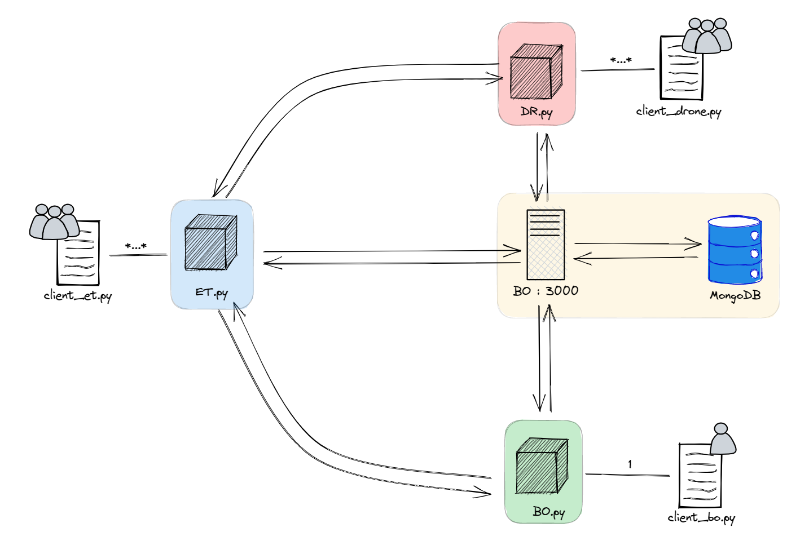

Como se puede observar, cada elemento de la red dispone de un cliente en python, que mediante una consola, recibe ordenes a realizar del usuario.

Cada cliente, instancia un objeto de la clase correspondiente (BO, ET o DR), con lo cual si queremos lanzar 2 ETs, habrá que lanzar dos clientes de *ET_client.py*

Se pueden lanzar tantos drones y ets como se deseen, pero tan solo una instancia de la BO, ya que esta es única en el sistema.

Como comentó anteriormente, la BO tiene un cliente, porque debe poder ejecutar comandos, pero tiene otra parte servidora. Este es un servidor http, que proporciona una API con las llamadas necesarias para registrar elementos de la red y conexiones, manteniendo así actualizado el sistema, guardando la infromacion en una base de Datos NoSql MongoDB.

**Importante: Solo el peer de la BO puede realizar operaciones de escritura a traves de la API en la base de datos, de esta manera se respeta la idea fundamental de la práctica. Con lo cual, cualquier registro de un Dron o una ET deberá ser a traves de la BO**

Finalmente, como se puede observar, hay también flechas desde los peers hacia el servidor de la BO, y esto puede sersultar contraproducente a lo que acabamos de comentar. Esto se debe a que siempre se necesita algo de información inicial antes de comenzar la conexión.

- En el caso del Dron, cuando el cliente introduce una ET. Simplemente se solicita al servidor la IP y
  el puerto de esa ET (si se encuentra escuchando), para abrir un socket.
- En el caso de la ET, se considera que la BO es un elemento central y auténtico, con lo cual las ETs deben
  disponer de su clave pública y direccion de escucha.

**Estos dos casos son los únicos donde se permite a los peers (que no son la BO) consultar al servidor información. No obstante, ningun peer puede realizar operaciones de escritura**

# Diagrama Entidad Relacion

A continuación se muestra el diagrama estidad relacion de la aplicacion:

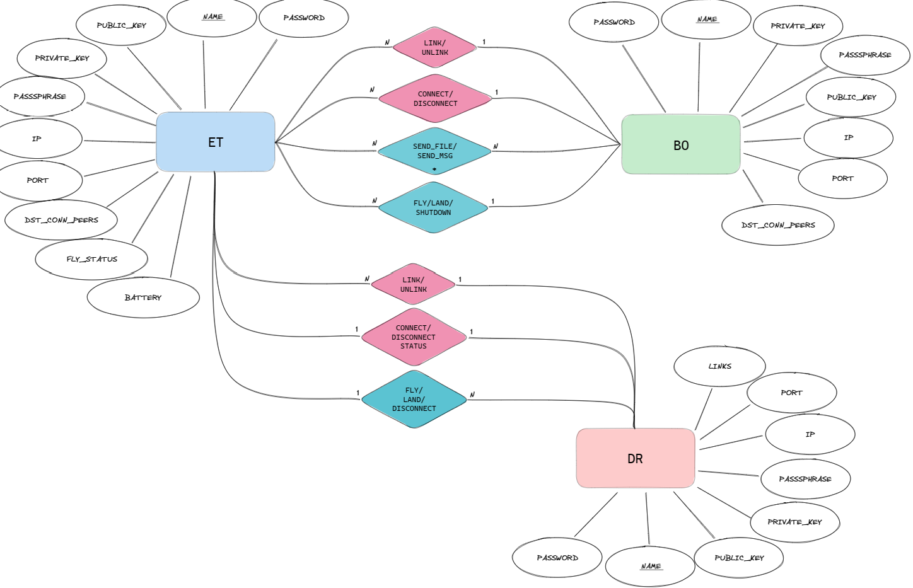

En primer lugar, observamos las tres **entidades** principales que ya conocemos como BO, ET y DR. Estas entidades tienen mas o menos los mismos **atributos**. Destacamos el atributo de nombre, el cual es único, y es el que nos permite identificar a las entidades; la contraseña, que nos proporciona ese sistema de registro y mantenimiento de sesiones; atributos para las claves asimetricas, así como atributos para la conexión con la IP y el puerto. El DR se distingue porque además tiene estado de vuelo y batería.

En cuanto a las **relaciones**, destacar que hay un flujo *ascendente*, que son aquellas relaciones de color rojo granate, cuyo flujo va DR -> ET -> BO; y el flujo *descendente*, con el color azul marino, el cual tiene un flujo BO -> ET -> DR.

*Destacar que hay mensajes que llegan desde el DR a la BO (siempre) a traves de la ET y que hay mensajes de la BO a los Drones tambien pasando por la ET*

*Comentar finalmente, que el único caso especial, es el de SEND_FILE y SEND_MSG, el cual también incluye el paso de mensajes y ficheros de una ET a otra ET que se explicrá mas abajo al igual que el resto de mensajes*

# Flujos de ejecución y explicación del funcionamiento de los comandos

## Handshake ET - BO

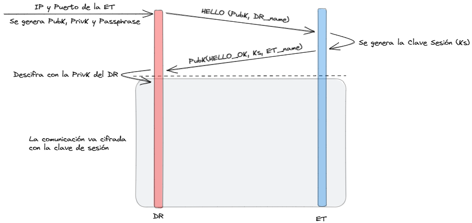

El flujo se da cuando en el cliente del DR se realiza **LINK**, **LOGIN** o **CONNECT**. El consulta la IP y el puerto de la ET a operar, y posteriormente genera el par de claves publica y privada para iniciar la comunicación. Como se aprecia en la imagen, se pasa la clave pública en plano, (vulnerable a ataques *Man in the middle*) y ya es la ET la que genera la clave de sesion y la cifra con la publica del dron, para que solo este sea capaz de descifrarla con su clave privada.

## Handshake DR - BO

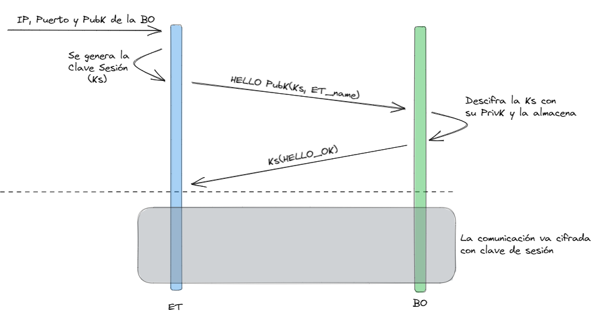

Este flujo ocurre cuando desde el cliente de la ET se indica el comando de **LINK** o de **LOGIN**. La ET consulta del servidor la IP, puerto y clave simétrica de la BO, a continuación genera una clave simétrica de sesión que cifra con la clave pública de la BO de este modo el único receptor que será capaz de descrifrar el mensaje será la BO con su clave privada garantizando la autenticidad de la comunicación.

## Comandos BO

### FLY / LAND

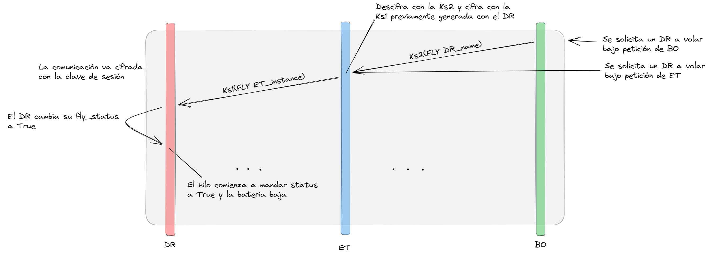

Este comando, es un comando *descendente*, ya que se puede lanzar desde tanto la BO como desde la ET (siempre que este previamente conectada al Dron). Cada una tiene sus peculiaridades, así que las comentaremos por separado:

La BO realiza una consulta a la Base de Datos, en el documento de conexiones, para ver si el Dron sobre el que quiere realizar la acción se encuentra en ese momento conectado. En caso de encontrar la conexion, se obtiene la ET que se mantiene conectada al Dron para así enviar el comando. Una vez recibe el comando, se realizaría el mismo flujo que desde la ET.

Desde la ET, se puede o venir de la BO (como se acaba de explicar), o desde el cliente de la ET, donde se elige un Dron (ya que la ET puede estar conectado a varios drones simultaneamente). Con lo cual, simplemente, coge ese Dron y le envia el comando *FLY / LAND* correspondiente.

Cuando el DR recibe el comando, actualiza su estado de vuelo, y el hilo de Status que tiene previamente lanzado (cuando comienza la conexion), empieza a enviar mensajes con el nuevo estado, donde se ve involucrada la bateria (ya que el fly status a True implica que esta volando, y por consecuente, la bateria baja).

### SEND_MSG y SEND_FILE

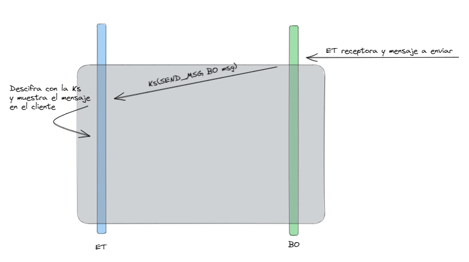

El flujo para enviar un mensaje o un fichero desde la BO a una ET es indentico.
Se deberá de indicar el nombre de la ET receptora y el mensaje o nombre del archivo, y posteriormente será enviado a la ET indicada.

La ET debe de estar no solo linkeada si no también opertativa, es decir, que haya realizado el proceso de handshake con la BO.

La diferencia entre ambos comandos sería que *SEND_MSG* muestra el contenido en pantalla, mientras que en el caso de *SEND_MSG* como junto al contenido del fichero se indica el nombre y extensión, la ET receptora escribirá el contenido en un fichero nuevo con el mismo nombre y extensión pero será almacenado en una carpeta distinta a donde se encuentra el archivo de origen.

Destacar que si se envía el mismo mensaje, los ficheros no se sobreescribirán, si no que aparceerá el nombre seguido de entre parentesis el numero de veces que aparece el fichero en la carpeta. Ej: fichero(3).pdf

### GET_STATUS

En el caso de este comando, la BO no envía ningun tipo de mensaje a las ETs. Puesto que en la base de datos se encuentran tanto los drones conectados como el estado de la bateria y si se encuentran o no volando, la BO se encarga de recuperar de la BO que drones estan conectados y a que ET, y los drones no conectados, además del estado de vuelo y de la batería, de esta forma la BO indica toda esa información. Respecto a la info de las ETs, puesto que al lanzar una ET esta se conecta a la BO, aquellas que esten en la lista de peers de la BO serán mostradas con un mensaje de coenctada y el resto no. En cualquiera de los casos, independientmente de ser un DR o una ET se muestra además la IP y puerto.

### SHUTDOWN

El flujo de este comando es una mezcla entra el de LAND Y DISCONNECT. La BO busca en su base de datos que DRs estan conectados y a que ET, una vez que conoce esta información le envía a las ETs correspondientes el mensaje de *SHUTDOWN* y el nombre del DR y la ET cuando lo reciba, en primer lugar enviará el mensaje de *LAND* y posteriormente el de *DISCONNECT*.

## Comandos ET

### LINK / UNLINK

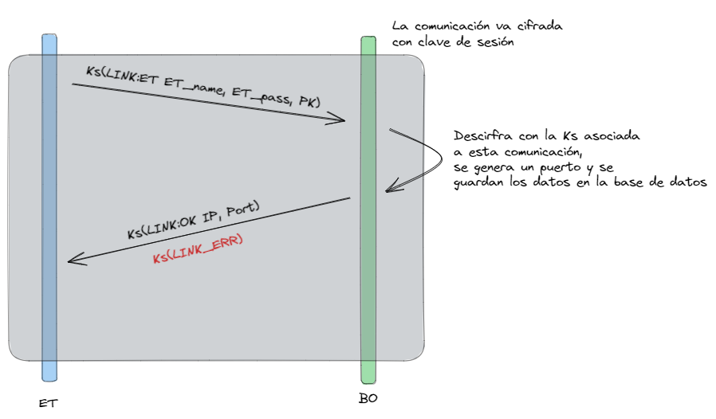

Cuando desde el cliente de la ET se indica el comando **LINK**,
se solicita introducir un nombre y contraseña para la ET, posteriormente se generan la clave pública, privada y el Passphrase y se realizaría el flujo de Handshake explicado más arriba.

Caundo la ET a registrar recibe el mensaje de *HELLO_OK* es cuando enviará el mensaje de *LINK* junto con el nombre, contraseña y clave pública generada anteriormente, dicho mensaje ira cifrado con la clave de sesión generada durante el proceso de handshake.

La BO recibirá un mensaje de *LINK*, generará un puerto y tratará de añadir la información a la base de datos. En este punto ocurren dos posibles situaciones. La primera sería que la información suministada por la ET no este registrada y entonces la BO devolverá el mensaje de *LINK_OK*, pero si dicha información ya se encuentra en la base de datos entonces devolverá un mensaje de *LINK_ERR*.

Si la ET recibe el mensaje de *LINK_OK* la ejecución del cliente continuará pero en caso de recibir *LINK_ERR* el cliente se cerrará.

Para el caso del comando *UNLINK* el flujo es muy similar, la ET le manda el mensaje a la BO y la BO elimina la ET de la cual recibe el mensaje de *UNLINK*, envia un mensaje de confirmación, *UNLINK_OK* y una vez que la ET lo recibe, se desconecta la conexión con la BO y se cierra el cliente.

### FLY / LAND

El flujo de esos dos es muy similar al flujo que ocurre cuando la BO es quien indica al drone *FLY / LAND*, es decir, desde el cliente de la ET se indica el drone al que enviar dicho comando, y en caso de estar conectado a el pues se buscar el peer correspondiente en su lista de peers y envia el comando correspondiente.

### SEND_MSG y SEND_FILE

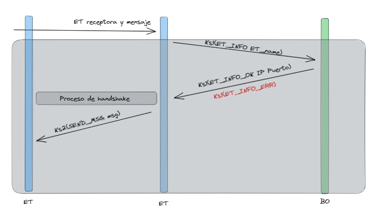

En el caso del envio de mensajes y ficheros desde una ET, el flujo es similar a cuando es la BO quien envía los mensajes o ficheros. Pero ahora hay 3 posibles situaciones:

1. Envío a la BO: Puesto que cuando una ET es vinculada o se inicia sesión en una ya se establece una conexión con la BO donde se realiza el proceso de handshake, la ET simplemente tendrá que buscar el peer correspondiente a la BO y enviar el mensaje de *SEND_FILE* o *SEND_MSG*.
2. Envío a una ET desconocida: En este caso la ET que enviará el mensaje o el fichero no conoce ni la IP ni el puerto de la ET receptora, por lo que le pedirá dicha información a la BO enviando un mensaje de *ET_INFO*, cuando la BO lo reciba revisará si dicha ET existe, si es así enviará un mensaje de *ET_INFO_OK* junto con la IP, puerto y public key de la ET solicitada, se realizará el proceso de handshake (el mismo que se muestra de Handshake ET - BO pero esta vez entre ETs) y una vez realizado se enviará el mensaje o fichero. Pero en caso de que la ET no exista se enviará un mensaje de *ET_INFO_ERR* y el flujo terminará.
3. Envío a una ET conocida: Este caso es una vez que ya se ha solicitado y establecido conexión con otra ET, donde no será necesario solicitar de nuevo la información a la BO y donde será posible enviar directamente el mensaje o fichero cifrado con la clave de sesión previamente generada y compartida.

### DISCONNECT

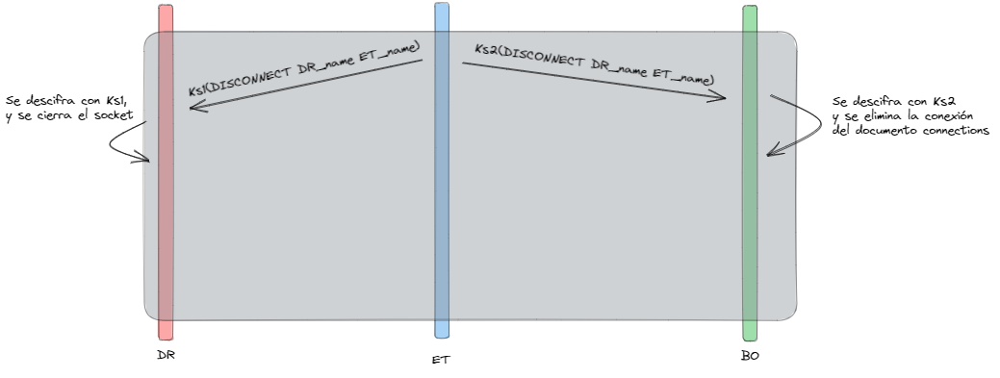

Aunque en la representación del flujo parece que el comando *DISCONNECT* es enviado simultaneamente a la BO y al DR, en realidad no es así. Tras indicar desde el cliente el DR a desconectar, se mira si realmente esta conectado y caso de estarlo, primero se envia el mensaje al DR quien al recibirlo cierra el socket de conexión y posteriomente el mensaje es enviado a la BO para que elimine la conexión del documento de conexiones.

### LOGIN

Este comando ha sido pensado por nosotros mismos, se debe indicar un nombre y contraseña, se busca en la carpeta en la que se encuentran todos los .pickle y en caso de exitir un .pickle con el nombre indicado se recogeran los datos, se validará si la contraseá es correcta y en caso de serlo se realizará el flujo de Handshake con la BO.

### LOGOUT

Este comando, al igual que el de *LOGIN* ha sido pensado por nosotros mismos, de modo que cuando desde el cliente se indica *LOGOUT* mira que peers tiene creados y les manda un mensaje de DISCONECT para que los otros elementos cierren el socket de conexión y eliminen el peer de sus listas. Posteriormente se crea un archivo .pickle con el nombre de la ET en el que se guarda información como el nombre de la ET, contraseña, clave privada y Passphrase.

## Comandos DR

### LINK / UNLINK

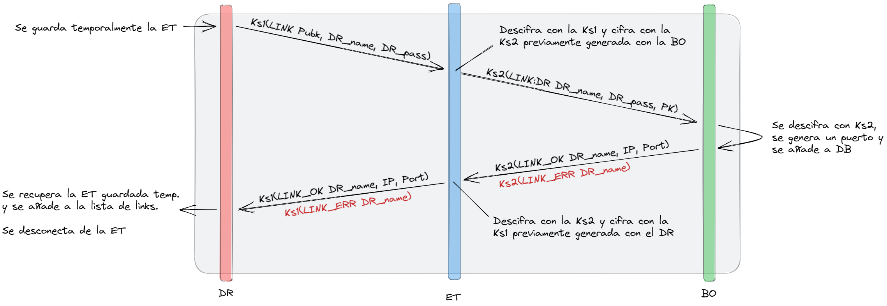

Este paso es inmediatamente posterior a realizar el handshake, el dron almacena temporalmente la instancia de la ET con la que se quiere linkear, y envia sus credenciales (cifradas con la clave de sesion previamente generada), el comando de *LINK*.

A continuacion, la ET descifra con la simetrica y simplemente cifra con la simetrica pero esta vez de la BO, replicando el mismo comando de *LINK*.

Finalmente, la BO descifra con esa simétrica, y crea un puerto para ese Dron, y añade el registro del dron a la Base de Datos. En caso de ya existir ese Dron, devuelve un *LINK_ERR*.

En caso de no existir el dron, envia un *LINK_OK*, con lo cual, se replica el flujo en la otra direccion. Cuando el Dron finalmente recibe el OK, pasa esa insatncia temporal de la ET a su lista de vinculados.

Para el caso de *UNLINK*, el caso es parecido, se envia a la ET. La ET lo reenvia a la BO. La BO elimina (de la lista de ETs vinculadas al Dron), la ET en cuestion, y manda mensajes de confirmacion. Cuando llega al Dron, este elimina tambien de su lista a esta ET para mantener la consistencia.

### CONNECT / DISCONNECT

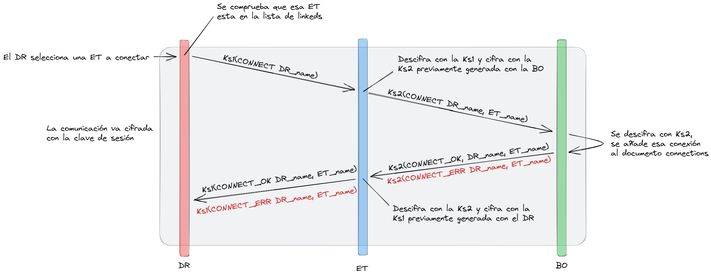

Este proceso no se va a explicar en profundidad, ya que es muy similar al de *LINK*, simplemente comentar que cuando llega a la BO, esta una instancia en el documento de conexiones de la base de datos de la ET junto al Dron que recibe en la peticion.

Devolviendo un *CONNECT_OK* en caso de ser posible, y *CONNECT_ERR* en caso de error.

Para el caso de *DISCONNECT*, el flujo es parecido, con la diferencia de que se manda el mensaje, se espera a que la ET lo reciba, la ET se lo manda a la BO para que esta elimine la conexion de la Base de Datos, y se cierra el socket de conexion con la ET en cuestión.

*Se ha considerado que cuando un Dron se desconecta, si este se vuelve a conectar su bateria vuelve a estar al 100% y se encontrará en tierra*

### STATUS / TELEMETRY

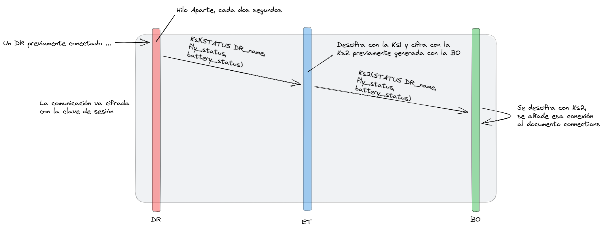

Para la operacion de *STATUS*, hay que tener en cuenta que se ejecuta en un hilo aparte, con lo cual no es bloqueante, simplemente, en segundo plano, se va mandando cada dos segundos el comando. Como se puede observar, este comando es *ascendente*, con lo cual va del Dron a la ET y este la reenvia a la BO.

En este se muestra el estado de vuelo, si esta volando o no; y la bateria en cada momento, la cual desciende si y solo si el dron esta volando (fly status a True).

Una vez la ET recibe el comando, como pasaba con otras operaciones, simplemente lo reenvia para que la BO actuelice ese estado en el documento del Dron correspondiente.

# Seguridad

Queremos comentar esta parte con algo más de información puesto que es la parte más importante de la práctica.

Toda la funcionalidad que corresponde con la parte de generación de claves, cifrado de clave simetrica y cifrado de cadenas de texto y cadenas de bytes se encuentra en el fichero *encryption.py* en la ruta *"src/encryption.py"*.

Las claves RSA que se generan son de 2048 bits de longitud y son generadas con un passphrase de 10 caracteres de longitud aleatorio cada vez que se generan un par de claves RSA. Decidimos utilizar un passphrase porque proporciona más seguridad ya que dicho passphrase es utilizado para cifrar la clave privada de modo que aunque la clave privada sea comprometida, si no se cuenta con dicho passphrase no se podrán descifrar los mensajes.

Respecto a la clave de sesión que se genera en el proceso de handshake, tiene un logitud de 32 Bytes y se cifra con la clave pública del receptor de modo que solo podrá ser descifrada con la privada y el passphrase del receptor garantizando así que las comunicaciones seań secretas y auténticas.

El cifrado con la clave de sesión simetrica ha sido en modo CTR, decidimos este método porque se considera un cifrado seguro y porque es muy veloz. Y además se hacía uso de un nonce aletorio de 12 bytes (enviado junto al mensaje cifrado).

# Conclusiones

Queremos destacar que la clave pública que generamos es una cadena de bytes y al almacenarla en la base de datos se convertía en cadenas de caracteres, esto nos supuso serios problemas por lo que terminamos convirtiendola en base64 con una función del módulo base64 de python y cuando erá necesario utilziar la clave pública recogida de la base de datos se realiza un proceso de desconversión de base64 a cadena de bytes.

Algo similar tuvimos que hacer a la hora de enviar el nonce y el mensaje cifrado, puesto que el contenido cifrado y el nonce eran cadenas de bytes, y que en alguna ocasión no podrían ser convertidos en cadenas de caracteres con el método encode(). En el momento previo y posterior al envió y recepción de los mensajes, se hacía un proceso de conversión de cadena de bytes a representación hexadecimanl y desconversión respectivamente, de este modo solucionamos el problema comentado.
